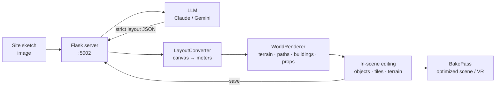

# CXR Visualization Tool (sketch2unity)

Turn a rough, hand-drawn, top-down site sketch into an editable, walkable 3D environment in Unity.
Upload an image of a site plan; a large language model (Claude or Gemini) interprets it into a
structured scene description; Unity renders that as terrain, paths, buildings, and props; then you
edit, refine, save, and "bake" the result into an optimized scene for VR or lightweight playback.

The goal is to compress the gap between an early-stage design sketch and a spatially-accurate 3D
model — from paper concept to navigable environment in minutes instead of hours of manual modeling.

## Contents

- [How it works](#how-it-works)
- [Quick start](#quick-start)
- [Typical workflow](#typical-workflow)
- [Features](#features)
- [VR walkthrough & live sync](#vr-walkthrough--live-sync)
- [Edit-mode controls](#edit-mode-controls)
- [Data & storage](#data--storage)
- [Key technologies](#key-technologies)

## How it works



Three cooperating parts:

1. **Python / Flask backend** ([server/server.py](server/server.py)) — a local REST API (port 5002)
   bridging the AI model and Unity: sketch-to-layout generation, a JSON-file library for
   environments and buildings (full CRUD with archive/soft-delete), image upload/serving, and
   search/download endpoints.
2. **Layout interpreter** ([layout_prompt.py](layout_prompt.py) +
   [prompts/site_parsing.md](prompts/site_parsing.md)) — sends the sketch, a detailed parsing
   prompt, and real-world site dimensions (a lot-boundary polygon on a normalized 0–1000 canvas) to
   the model, which returns one strict JSON object classifying every sketch element into terrain
   zones, paths, buildings, box-primitive objects, or prefab props — all inside the lot boundary and
   at real-world scale.
3. **Unity frontend** ([unity/CXRBrownfield/Assets/Scripts/](unity/CXRBrownfield/Assets/Scripts/)) —
   `LibraryClient` talks to the API; `LayoutConverter` maps normalized coordinates into world
   meters; `WorldRenderer` builds the scene; `EditController` / `TileBuildingEditor` provide
   in-scene editing; `LibraryBrowser` / `ModelRequesterUI` are the UI panels; `BakePass` merges
   meshes for export. ScriptableObject registries (PrefabRegistry, TerrainRegistry,
   TileShapePalette, MaterialPalette, PathMaterialPalette, FencePalette, DecorPalette) map the
   string keys in the AI's JSON to concrete Unity assets.

## Quick start

**1. Python backend** (Python 3, from the repo root):

```bash
python -m venv .venv
# Windows (PowerShell):        .venv\Scripts\Activate.ps1
# macOS / Linux:               source .venv/bin/activate
pip install -r requirements.txt   # large install (torch, open3d, ...)
```

**2. API key** — create a `.env` file at the repo root (loaded automatically):

```
ANTHROPIC_API_KEY=sk-ant-...
```

Claude is the default provider. To use Gemini instead, set `GOOGLE_API_KEY` and flip
`CURRENT_PROVIDER = "gemini"` at the top of [layout_prompt.py](layout_prompt.py).

**3. Run the server:**

```bash
python server/server.py
```

Serves on `0.0.0.0:5002` (set `M2U_DEBUG=1` for Flask debug mode). Smoke-test without any API key:

```bash
curl http://localhost:5002/health
curl http://localhost:5002/api/environments
```

**4. Unity** — open [unity/CXRBrownfield](unity/CXRBrownfield/) in Unity **6000.3.10f1**, open the
`BasicModel` scene, and enter Play mode. `LibraryClient.serverBaseUrl` should point at
`http://localhost:5002`.

## Typical workflow

1. Start the backend (`python server/server.py`).
2. In Unity Play mode, choose **Generate Layout** and pick a sketch image (upload a new one or
   reuse a previous input).
3. The server sends the image + site-parsing prompt + real-world dimensions to the LLM and gets
   structured layout JSON back. (`POST /api/layout/generate` also accepts an optional `site` preset
   or explicit `lot_boundary` / `site_width_ft` / `site_height_ft` fields.)
4. `LayoutConverter` turns the JSON into an editable environment, saved to the library and rendered
   by `WorldRenderer`.
5. Edit: select/move/rotate/scale instances, double-click a building to tile-edit its shape,
   repaint faces and place decor, draw paths and fences, scatter greenery, paint ground.
6. **Save** (or **Save As**) back to the library.
7. **Bake** to merge meshes into a single optimized scene for VR or lightweight playback.

## Features

### AI sketch interpretation

- One LLM call converts an uploaded sketch into a structured scene description across five
  categories: **terrain_zones** (ground surfaces), **paths** (width-bearing polylines),
  **generated_buildings** (floor × bay grids, inferred floors/rotation, wedge/trapezoid corners),
  **generated_objects** (box primitives for irregular structures), and **prefab_instances**
  (repeatable props with position, rotation, scale).
- Selectable provider: Anthropic Claude (default) or Google Gemini; the Claude path streams with
  adaptive thinking for large structured output, with retry/backoff on rate limits.
- Real-world scale enforcement: site width/height in feet plus an authoritative lot-boundary
  polygon (normalized 0–1000 canvas) — all placements must fall inside the lot.
- Strict, schema-locked JSON output (directly parseable, no fences or commentary); the server
  sanity-checks the result and returns a `warnings` list.

### Backend REST API & data store

- Full CRUD for environments and buildings (list/create, get/put by id, archive as soft-delete),
  with automatic unique naming and cross-folder id resolution.
- Records split by *kind*: environments into `user` / `generated`, buildings into `static` /
  `cached`; list endpoints filter with `?kind=`.
- Input image management (`POST/GET /api/inputs`), generic list/search/download endpoints, and a
  `/health` check.
- Pure JSON-file storage under `server/data/` — no external database; raw LLM output archived per
  source image under `layouts/`.

### Scene rendering

- Terrain painting from terrain zones into Unity's splatmap system, sized to the lot with a parcel
  polygon masking everything outside it.
- Path ribbons (textured mesh strips) and fence runs (repeated panel prefabs with posts) built
  along polylines and draped onto the terrain.
- Modular tile-based buildings: grids of tile shapes (square, wedge, quarter-curve) with per-face
  materials, multi-floor support, angled footprints, and whole-building deforms — plus a
  massing-box fallback for buildings without tiles.
- Prefab placement, embedded per-face decor (doors, windows, vents), and free-painted surface
  strokes layered over the base zones.
- ScriptableObject registries map every JSON string key to concrete assets; a registry exporter
  syncs the keys back into the LLM prompt so the model only emits keys Unity can resolve.

### Editing — objects & instances

- Full camera control (orbit / pan / zoom / WASD) and click selection with Tab-cycling through
  overlapping hits.
- Multi-selection (Shift/Ctrl+click) with transforms applied across the set; group rotation about
  each pivot or the selection center.
- G/R/T grab-rotate-scale, an on-screen gizmo (arrows, free-move pad, rotate ring, scale cube),
  arrow-key nudging, and exact rotation/scale sliders in the right panel.
- Copy/paste (Ctrl+C/V) of instances at the cursor, including across environments.

### Editing — tile building editor

- Double-click a building to enter tile-edit mode.
- **Add** paints/erases tiles to reshape footprint and floors; **Select** multi-selects tiles and
  rotates them about a chosen axis.
- **Paint** assigns face materials by dragging; **Decorate** places one auto-fitted decorative prop
  per tile face (doors anchor bottom, windows center), with erase support.
- **Whole face** mode applies a material or decor across an entire exposed building side in one
  click; all painted decor persists on the building definition and round-trips through save/load.

### Terrain editor

- **Draw paths** and **Draw fences**: straight (waypoint) or freehand drawing, editable control
  points, per-item delete; paths take a material + width, fences a palette type + height.
- **Paint objects**: scatter prefabs (trees, greenery) by radius/density with random
  rotation/scale, plus an erase mode.
- **Paint ground**: brush terrain surfaces directly into the splatmap as surface strokes.
- Everything lives inside the environment JSON, so hand-drawn and AI-generated terrain are
  interchangeable and both round-trip through the server.

### Multi-environment library

- The library browser lists environments and buildings with Load / Edit / Close / Save / Save As.
- Multiple environments load into one scene at a shared origin; exactly one is **active**
  (editable, saveable, terrain-owning) while the rest are dimmed, collider-less backdrops.
- A persistent **locked** flag supports digital-twin backdrops: a locked environment can be active
  (it paints the terrain) but is read-only everywhere; **Save As / Duplicate** produce an unlocked
  copy — the sanctioned "design on top of the twin" flow.

### Baking / export

- `BakePass` merges scene meshes into a single optimized scene for VR or lightweight playback.

## VR walkthrough & live sync

A VR headset (or second PC) can mirror the desktop host's full loaded set in real time. The model
is **publish → poll → re-render**: the host publishes its loaded environments to the server
(`/api/active`), and read-only viewers poll, diff versions, and re-render idempotently — no deltas
or conflict resolution.

- **Host**: a **Live** toggle in the Library header publishes the loaded set and debounce-auto-saves
  edits (~1 s) so viewers pick up changes within the poll interval.
- **Viewer**: the `VRViewer` scene runs a `SyncClient` (polling ~1.5 s) with editing components
  disabled and an XR Origin rig (OpenXR + XR Interaction Toolkit). On a headset, point
  `LibraryClient.serverBaseUrl` at the host PC's LAN IP.
- **Builds** (Unity `Build` menu): **Desktop (PC)** ships only `BasicModel` with no VR;
  **VR — Quest (Android)** and **VR — PCVR (Windows)** ship only `VRViewer`. XR never initializes
  on startup — only `VRViewer`'s `XRBootstrap` starts it, and it falls back to flat mode if no
  headset is present.

## Edit-mode controls

| Input | Action |
|---|---|
| Right-drag / middle-drag / scroll / WASD | Orbit / pan / zoom / pan camera |
| Left-click, Shift/Ctrl+click, Tab | Select · multi-select · cycle overlapping hits |
| G / R / T | Grab / rotate / scale selected (Shift snaps rotation to 15°) |
| Gizmo handles | Arrows move on X/Z, pad free-moves, ring rotates, cube scales |
| Arrow keys | Nudge selected |
| Ctrl+C / Ctrl+V | Copy / paste instances at the cursor |
| Double-click building | Enter tile-edit mode (Q/E rotate placement; X/Y/Z pick rotate axis) |
| Delete / Escape / Enter | Remove · cancel/exit · confirm (or finish a path/fence) |

See [docs/editing-controls.md](docs/editing-controls.md) for the full controls table,
[docs/unity-scene-wiring.md](docs/unity-scene-wiring.md) for Unity inspector wiring and the
ScriptableObject assets to create, and [docs/vr-live-sync.md](docs/vr-live-sync.md) for the VR
viewer and live-sync details. [CLAUDE.md](CLAUDE.md) is the developer quick map.

## Data & storage

All persistent data is JSON under `server/data/`, split by kind — never edit these by hand; all
changes flow through the REST API:

```
server/data/environments/user/       user-authored scenes
server/data/environments/generated/  AI-generated scenes
server/data/buildings/static/        user-authored buildings
server/data/buildings/cached/        AI-generated buildings
server/data/_archive/                soft-deleted records
input/                               uploaded sketch images (repo root)
layouts/<image-stem>.json            raw LLM layout output (repo root)
```

Records are UUID-named so building↔environment cross-references stay valid. An environment JSON is
fully self-describing — terrain zones, paths, fences, surface strokes, building instances (tile
layouts, face materials, embedded decor), and scattered objects — so every generated or hand-edited
feature saves, loads, and round-trips identically.

## Key technologies

- **Python 3, Flask + Flask-CORS** — backend & REST API (JSON-file store, no database)
- **Anthropic Claude / Google Gemini** — sketch interpretation
- **Unity (C#)**, Input System, Newtonsoft JSON — 3D rendering & editing
- **OpenXR + XR Interaction Toolkit** — VR viewer (Quest & PCVR)
- Modular tile-building system with prefab / material / shape / path / fence / decor palettes
